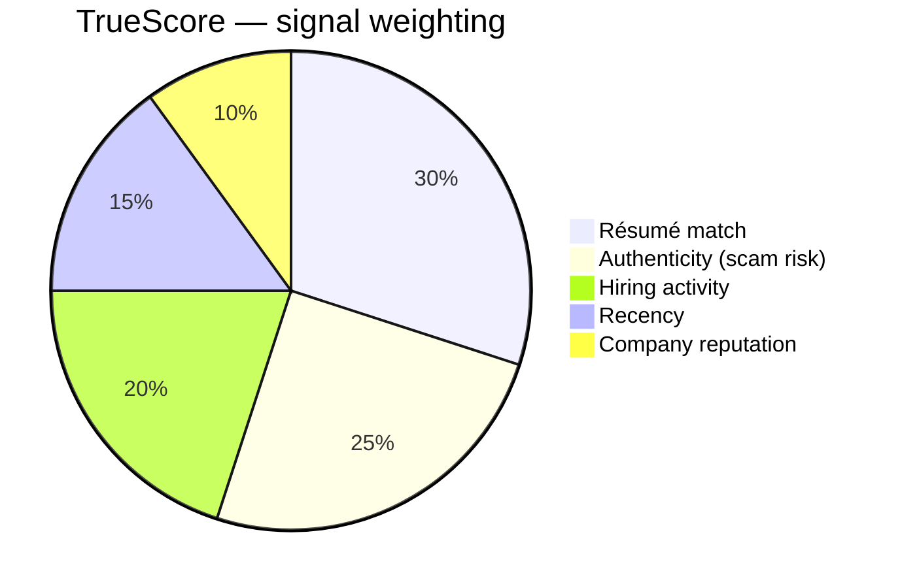
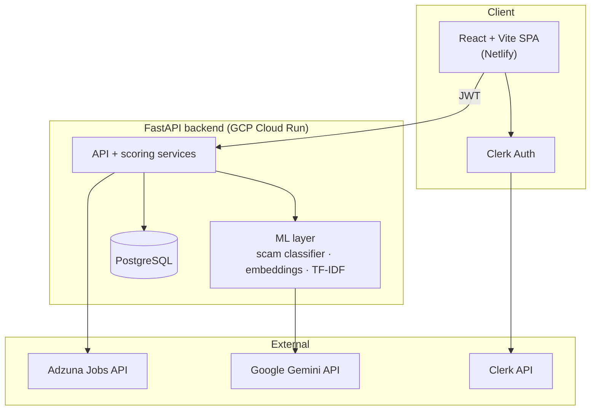

<div align="center">

# TrueHire

### AI-powered job safety & discovery platform for newcomers to Canada

Find legitimate, relevant jobs — and avoid scams and "ghost" postings — with a single trust score per listing.

[](https://tru3hire.netlify.app)
[](https://tru3hire.netlify.app)
[](#tech-stack)
[](#tech-stack)
[](#license)

**[🌐 Live Demo](https://tru3hire.netlify.app)**

</div>

---

## Overview

Job seekers — especially newcomers to a new country — waste weeks applying to postings that are scams, are no longer hiring ("ghost jobs"), or are a poor fit for their background. The signals needed to tell good listings from bad ones are scattered and hard to read.

**TrueHire condenses those signals into one number — the TrueScore™ — so users can decide where to spend their effort in seconds.** It combines machine-learning scam detection, real labour-market data, and résumé-to-job matching into a single, explainable score per job, with a focus on the Canadian market.

> This repository contains the full product: a React web app, a FastAPI backend with the scoring and ML services, and the infrastructure that runs them.

---

## What it does

| Feature | Description |
| --- | --- |
| 🛡️ **Scam detection** | Paste any job description (from anywhere) and get an instant risk assessment — *Safe / Caution / Danger* — with specific reasons (e.g. upfront-payment requests, suspicious contact methods, urgency tactics). |
| 🎯 **TrueScore™** | A 0–100 composite score per job across five dimensions (see below) that estimates how worthwhile a listing is to pursue. |
| 🔍 **Verified job search** | Search live Canadian job listings (via the Adzuna API) with province/city/remote filters, each pre-scored so low-quality postings surface last. |
| 💬 **Natural-language discovery** | Describe what you want in plain English; the backend extracts structured search signals and ranks results by relevance *and* TrueScore. |
| 📝 **Résumé matching & skill gaps** | Upload a résumé (PDF/DOCX) to get a personalized fit score per job and see which skills you're missing for a target role. |
| 🏢 **Company verification** | Check an employer against a database of known-legitimate companies, with fuzzy name matching. |
| 📌 **Application tracking** | Log applications and outcomes to keep your search organized. |

---

## How the TrueScore works

TrueScore is a weighted composite of five signals, each answering a question a job seeker actually cares about:



| Signal | Question it answers | How it's measured |
| --- | --- | --- |
| **Résumé match** | *Do my skills fit this role?* | Semantic similarity between résumé and job text using embeddings (Google Gemini, with a local model fallback) |
| **Authenticity** | *Is this real or a scam?* | A RandomForest classifier trained on the public EMSCAD dataset (17,880 labeled postings), combined with rule-based red-flag detection |
| **Hiring activity** | *Are they actually hiring?* | Real market signals derived from live job-board data |
| **Recency** | *Is this still fresh?* | Posting-age decay — newer listings score higher |
| **Company reputation** | *Who is this employer?* | Lookup against a verified-company database |

Every score is **explainable** — the UI surfaces the specific reasons behind a rating rather than just a number.

---

## Architecture



The backend authenticates requests with Clerk-issued JWTs (verified via JWKS), enforces per-endpoint rate limits, and degrades gracefully — if the embedding provider is unavailable, scoring falls back to local methods rather than failing.

---

## Tech stack

| Layer | Technology |
| --- | --- |
| **Frontend** | React 18, TypeScript, Vite, Tailwind CSS, Radix UI |
| **Auth** | Clerk (JWT / JWKS) |
| **Backend** | FastAPI (Python 3.11), Uvicorn |
| **Machine learning** | scikit-learn (RandomForest, TF-IDF), Google Gemini embeddings, SentenceTransformers (fallback) |
| **Data** | Adzuna Jobs API · PostgreSQL (production) / SQLite (local dev) |
| **Hosting** | Netlify (frontend) · Google Cloud Run (backend) |
| **Tooling** | Yarn workspaces (monorepo), Vitest, Pytest, GitHub Actions CI |

---

## Repository structure

```
.
├─ packages/
│  ├─ frontend/        # React + TypeScript web app (Vite, Tailwind, Clerk)
│  └─ backend/         # FastAPI app: scoring & ML services, routes, tests
├─ shared/             # Shared types and helpers
├─ documentation/      # Public technical & ML documentation
├─ cloudbuild.yaml     # Backend deploy (Google Cloud Run)
└─ netlify.toml        # Frontend deploy (Netlify)
```

---

## Getting started

**Prerequisites:** Node.js 18+, Yarn, Python 3.11+, Git.

```bash
# 1. Install workspace (frontend) dependencies
yarn install

# 2. Set up the backend
cd packages/backend
python -m venv .venv
# Windows:        .\.venv\Scripts\Activate
# macOS/Linux:    source .venv/bin/activate
pip install -r requirements.txt

# 3. Run both servers (from the repo root)
yarn dev
```

- Frontend → http://localhost:3000
- Backend API docs → http://localhost:8000/docs

Both the frontend and backend read configuration from environment variables (see the `.env.example` files in each package). For full cross-platform setup, environment configuration, and deployment instructions, see **[documentation/public/TechnicalReadMe.md](documentation/public/TechnicalReadMe.md)**.

---

## Testing

```bash
# Frontend (Vitest)
yarn workspace frontend test

# Backend (Pytest) — run from packages/backend
python -m pytest
```

Frontend type-checking and build, plus the backend test suite, run automatically in CI on every pull request.

---

## Roadmap

- **Outcome feedback loop** — learn from real application outcomes to continuously improve scoring
- **Stronger ghost-job detection** — flag reposted and stale listings
- **Refreshed scam model** — retrain on modern scam patterns (e.g. task/crypto-payout scams)
- **Credential-pathway guidance** — map roles to the certifications needed in a given province

---

## License

Released under the **MIT License**.

---

<div align="center">

Built to help people find real work, safely.

</div>
