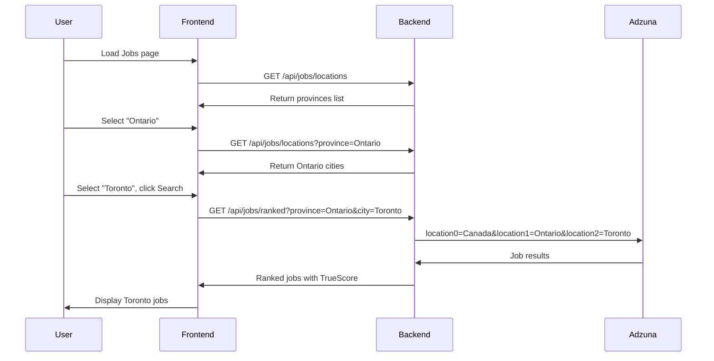

# Walkthrough: Province & City Location Filtering

## Summary

Implemented province and city filtering for Canadian job searches with cascading dropdown selectors. Users can now narrow their job search by selecting a province and optionally a specific city within that province.

## Features

### Cascading Dropdowns
1. **Province dropdown** - Shows all 13 Canadian provinces/territories
2. **City dropdown** - Appears after selecting a province, shows major cities

### Smart URL Parameters
Search state is preserved in URL params:
```
/jobs?q=developer&province=Ontario&city=Toronto
```

## Files Created/Modified

### Backend

| File | Type | Description |
| ---- | ---- | ----------- |
| [canada_locations.py](file:///c:/Users/OMOTOSHO/Desktop/myJourney/Fake-Job-Posting-Tracker/packages/backend/app/data/canada_locations.py) | NEW | Static data with 13 provinces and 100+ cities |
| [__init__.py](file:///c:/Users/OMOTOSHO/Desktop/myJourney/Fake-Job-Posting-Tracker/packages/backend/app/data/__init__.py) | NEW | Data module init |
| [jobs.py (services)](file:///c:/Users/OMOTOSHO/Desktop/myJourney/Fake-Job-Posting-Tracker/packages/backend/app/services/jobs.py) | MODIFIED | Added province/city params using Adzuna's locationN |
| [jobs.py (routes)](file:///c:/Users/OMOTOSHO/Desktop/myJourney/Fake-Job-Posting-Tracker/packages/backend/app/routes/jobs.py) | MODIFIED | Added `/locations` endpoint |

### Frontend

| File | Type | Description |
| ---- | ---- | ----------- |
| [JobsPage.tsx](file:///c:/Users/OMOTOSHO/Desktop/myJourney/Fake-Job-Posting-Tracker/packages/frontend/src/pages/JobsPage.tsx) | MODIFIED | Cascading Province/City dropdowns |

## API Reference

### GET /api/jobs/locations

Returns all Canadian provinces.

**Response:**
```json
{
  "provinces": [
    {"code": "AB", "name": "Alberta"},
    {"code": "BC", "name": "British Columbia"},
    {"code": "MB", "name": "Manitoba"},
    {"code": "NB", "name": "New Brunswick"},
    {"code": "NL", "name": "Newfoundland and Labrador"},
    {"code": "NS", "name": "Nova Scotia"},
    {"code": "NT", "name": "Northwest Territories"},
    {"code": "NU", "name": "Nunavut"},
    {"code": "ON", "name": "Ontario"},
    {"code": "PE", "name": "Prince Edward Island"},
    {"code": "QC", "name": "Quebec"},
    {"code": "SK", "name": "Saskatchewan"},
    {"code": "YT", "name": "Yukon"}
  ]
}
```

### GET /api/jobs/locations?province=Ontario

Returns cities for a specific province.

**Response:**
```json
{
  "province": "Ontario",
  "cities": [
    "Toronto", "Ottawa", "Mississauga", "Brampton", "Hamilton",
    "London", "Markham", "Vaughan", "Kitchener", "Windsor",
    "Richmond Hill", "Oakville", "Burlington", "Greater Sudbury",
    "Oshawa", "Barrie", "St. Catharines", "Cambridge", "Kingston",
    "Guelph", "Waterloo", "Thunder Bay", "Chatham-Kent", "Whitby",
    "Ajax", "Pickering", "Niagara Falls", "Peterborough",
    "Sault Ste. Marie", "Newmarket"
  ]
}
```

### GET /api/jobs/ranked?province=Ontario&city=Toronto

Searches for jobs with location filtering using Adzuna's `locationN` parameters:
- `location0=Canada`
- `location1=Ontario`
- `location2=Toronto`

## How It Works



## Verification

- ✅ Backend starts without errors
- ✅ `/api/jobs/locations` returns 13 provinces
- ✅ `/api/jobs/locations?province=Ontario` returns 30 cities
- ✅ Frontend builds successfully
- ✅ Province dropdown populated on page load
- ✅ City dropdown updates when province changes

---

*Completed: December 30, 2024*
