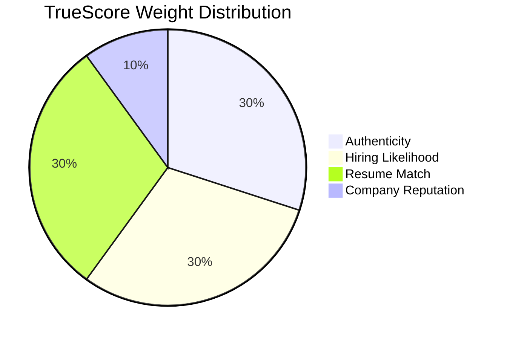
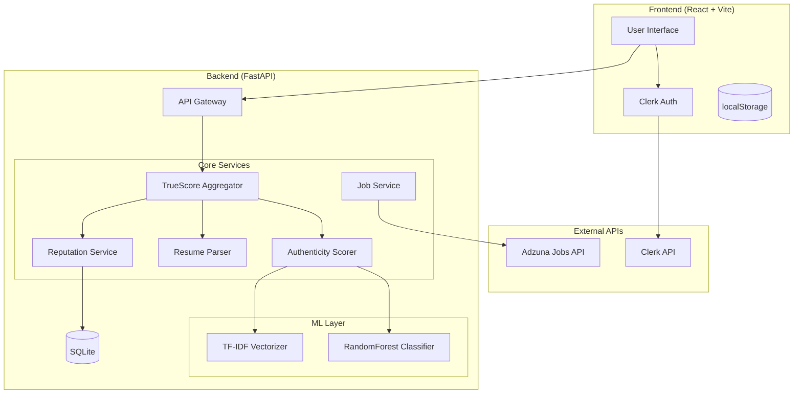
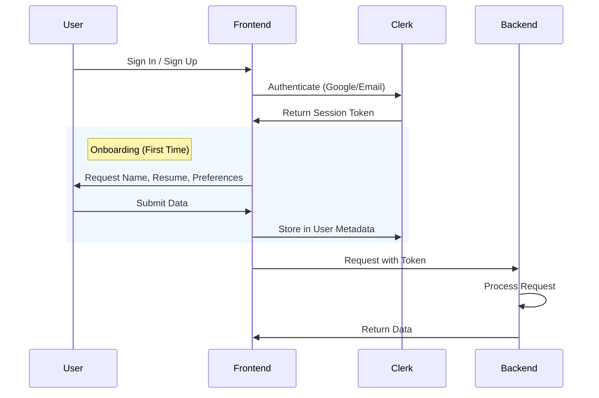

# TrueHire - AI-Powered Job Safety Platform

> **A comprehensive platform empowering newcomers to Canada to find safe, legitimate, and relevant specialized employment opportunities.**

[](https://tru3hire.netlify.app)
[](https://truehire-backend.onrender.com)
[](LICENSE)

---

## 📖 Table of Contents

1. [Overview](#overview)
2. [The Problem](#the-problem)
3. [Our Solution](#our-solution)
4. [The TrueScore System](#the-truescore-system)
5. [Architecture](#architecture)
6. [Core Features](#core-features)
7. [Authentication Flow](#authentication-flow)
8. [Setup & Development](#setup--development)
9. [Vision & Roadmap](#vision--roadmap)

---

## Overview

TrueHire is more than just a fake job detector—it is a **holistic job safety and verified discovery platform** built specifically for newcomers to the Canadian job market.

Moving to a new country and finding work is challenging. Newcomers often lack "insider knowledge" about local companies, salary norms, and recruitment processes, making them vulnerable to sophisticated employment scams and resulting in months of wasted applications on unsuitable roles.

**TrueHire bridges this gap** by combining:

- **AI-Powered Safety**: Instantly detecting scams and high-risk postings.
- **Strategic Insight**: Evaluating "Hiring Likelihood" and "Resume Fit" so users apply to the _right_ jobs.
- **Local Context**: Leveraging Canadian job data and community insights (Reddit/Glassdoor).

---

## The Problem

Every year, thousands of skilled newcomers to Canada fall victim to:

1.  **Fraudulent Job Postings**: Identity theft and financial scams disguised as employment offers.
2.  **Wasted Applications**: Spending hours applying to "ghost jobs" or roles that aren't actively hiring.
3.  **Mismatched Opportunities**: Applying to roles where they are overqualified or underqualified due to misunderstanding local job market nuances.
4.  **Lack of Insider Knowledge**: Missing critical context about company reputation and culture that locals might take for granted.

---

## Our Solution

TrueHire solves these problems with a unified **TrueScore™** metric. Instead of just "Real vs. Fake", we assess the **Total Opportunity Value** for the user.

| Problem         | TrueHire Solution                     | TrueScore Dimension          |
| --------------- | ------------------------------------- | ---------------------------- |
| **Scams**       | ML Classifier + Scam Pattern Analysis | **Authenticity (30%)**       |
| **Ghost Jobs**  | Job Activity & Recency Analysis       | **Hiring Likelihood (30%)**  |
| **Poor Fit**    | NLP-based Resume Matching             | **Resume Match (30%)**       |
| **Bad Culture** | Community Sentiment Mining            | **Company Reputation (10%)** |

---

## The TrueScore System

TrueScore is our proprietary composite metric (0-100) that evaluates job postings across 4 dimensions to predict the **probability of a successful interview**.



### 1. Authenticity Score (30%)

_"Is this job real or a scam?"_

- **ML Component (70%)**: RandomForest model trained on 17,880 labeled job postings (Kaggle dataset).
- **Rule Component (30%)**: Heuristic detection of financial requests, PII mining, and urgency tactics.

### 2. Hiring Likelihood (30%)

_"Will they actually hire someone?"_

- Analyzes job text for urgency signals ("Immediate start", "Urgently hiring").
- Penalizes "ghost job" indicators like vague descriptions or stale postings (older than 30 days).

### 3. Resume Match (30%)

_"Do your skills match the job?"_

- Uses **TF-IDF Cosine Similarity** to compare your uploaded resume against the job description.
- Weighs rare technical skills higher than generic buzzwords.
- Helps newcomers target roles where they are most competitive.

### 4. Company Reputation (10%)

_"What do people say about this employer?"_

- Checks against a database of verified Canadian employers (Fortune 500, Banks, Tech Giants).
- (Vision) Scrapes sentiment from community discussions (Reddit/Glassdoor) to provide "insider" cultural context.

---

## Architecture



### Technology Stack

| Layer        | Technology         | Why We Chose It                            |
| ------------ | ------------------ | ------------------------------------------ |
| **Frontend** | React + TypeScript | Type safety, component reusability         |
| **Auth**     | Clerk              | Industry-standard security, seamless OAuth |
| **Backend**  | FastAPI (Python)   | High-performance async support, ML-native  |
| **ML**       | scikit-learn       | Efficient, interpretable, runs on CPU      |
| **Jobs API** | Adzuna             | Best free coverage of Canadian job market  |
| **Hosting**  | Netlify + Render   | Reliable, zero-cost infrastructure         |

---

## Core Features

### 1. 🔍 Verified Job Search

Search pre-vetted Canadian jobs via the Adzuna API. Every job result includes a preliminary TrueScore, allowing users to filter out low-quality or suspicious listings _before_ clicking.

- **Filter**: Province, City, Remote/On-site
- **Safety**: "Verified" badges for known safe employers via our database.

### 2. 🛡️ Job Analysis Tool

Paste any job description from any site (Indeed, LinkedIn, etc.) to get an instant safety and quality report.

- **Risk Assessment**: Safe / Caution / Danger levels.
- **Actionable Insights**: Specific warnings (e.g., "Requests payment", "Unprofessional email").

### 3. 📝 Resume Analysis & Matching

Upload your resume (PDF/DOCX) to unlock personalized features:

- **Skill Extraction**: Automatically parses your skills.
- **Gap Analysis**: Shows which skills you are missing for a specific job.
- **Match Score**: See your fit percentage for every job you view.

### 4. 🏢 Company Verification

"Who is this company?"

- **Database Lookup**: Instant verification against our list of legitimate companies.
- **Sentiment Analysis**: Detecting positive/negative cultural signals in the job text.

---

## Authentication Flow

We use Clerk for secure, modern authentication.



---

## Setup & Development

### Prerequisites

- Node.js 18+
- Python 3.10+
- Git

### Quick Start

1.  **Backend Setup**

    ```bash
    cd packages/backend
    python -m venv .venv
    # Windows: .venv\Scripts\activate
    # Mac/Linux: source .venv/bin/activate
    pip install -r requirements.txt
    uvicorn main:app --reload
    ```

2.  **Frontend Setup**

    ```bash
    cd packages/frontend
    npm install
    npm run dev
    ```

3.  **Environment Variables**
    - Frontend: `VITE_CLERK_PUBLISHABLE_KEY`, `VITE_API_URL`
    - Backend: `ADZUNA_APP_ID`, `ADZUNA_APP_KEY`

---

## Vision & Roadmap

TrueHire is evolving into a complete career companion for newcomers.

### Phase 1: MVP (Current)

- ✅ Fake Job Detection (ML + Rules)
- ✅ TrueScore™ Algorithm
- ✅ Resume Matching (TF-IDF)
- ✅ Verified Job Search (Adzuna)

### Phase 2: Growth & Community (Next Steps)

- 🚀 **Skill Gap Analysis**: Suggest specific courses (Coursera/Udemy) to fill missing skills.
- 💬 **Community Insights**: Direct integration with Reddit/Blind API to show real employee discussions.
- 🧠 **Browser Extension**: Analyze jobs directly on Indeed/LinkedIn with a single click.
- 🎓 **Newcomer Resources**: Curated guides on Canadian workplace culture and rights.

---

_Verified. Safe. Empowering._
**TrueHire - Building a Bridge for Newcomers.**
